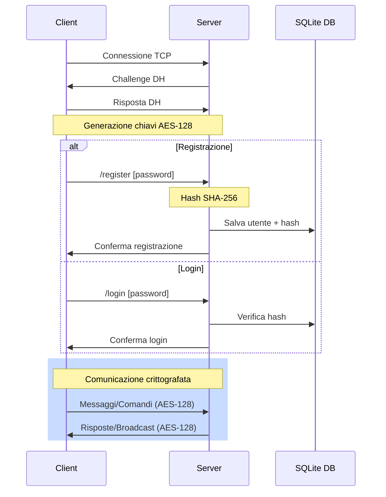

# SRC (Simple Rust Chat)

Simple Rust Chat è una chat Client/Server TCP

La chat è basata molto sull'idea di una chat IRC (inizialmente il progetto aveva come scopo la creazione di un server IRC da utilizzare con dei clienti IRC come Halloy o mIRC)


## Linguaggio

Ho utilizzato Rust come linguaggio per questo programma per la sua velocità e leggerezza che permette di farlo runnare anche su sistemi con componenti poco potenti. Anche il client è scritto in Rust per compatibilità tra librerie utilizzate nel client e nel server. Permette anche di essere dockerizzato come immagine il server che permette di scalare il server utilizzando Kubernets o altri sistemi di scalability.

## Librerie

Le librerie utilizzate in particolare sono Tokio, un framework per applicazioni async e che offre anche connessioni Socket. Per la gestione del database viene usato SQLx, una libreria che offre una connessione standard per vari tipi di DBMS.
serde: Per serializzazione/deserializzazione strutturata dei pacchetti
log + env_logger: Per logging strutturato


## Funzioni
### Funzioni Fondamentali:
- Chattare con altri utenti in canali per topic
- Chattare con una persona sola (DMs)
- Inviare i file tra utenti
- Possibilità di amministrare la chat con comandi di /kick o /ban
- Usa un Db SQLite per tenere le informazioni degli utenti registrati
    - È possibile registarsi usando /register password che viene salvata usando SHA-256 e usare dal prossimo login il comando /login

### Funzionalità opzionali che si potrebbero aggiungere:
- Lista utenti online per canale
- Cronologia messaggi
- Sistema di ruoli più granulare
- Notifiche di menzione (@user)

## Protocolli e Sicurezza

Il server utilizza TCP/IP come protocollo per la trasmissione dei dati in rete. I pacchetti sono composti da un pacchetto prestabilito

```
    /*
        Specifications of the packet
        32 bytes - Command name
        512 bytes - Command argument
        if command is empty then it is a message
    */
```

La chat è sicura usando x25519-dalek e AES-128 per criptare i messaggi e i dati dei file che vengono inviati. Lo scambio di chiavi viene effettuato con Diffie Hellman

Il Db è SQLite che permette di usarlo da un singolo file senza nessun problema. Per lo sviluppo sono utilizzate le mitigations cosi da aggiornare il db anche con versione vecchie del server

